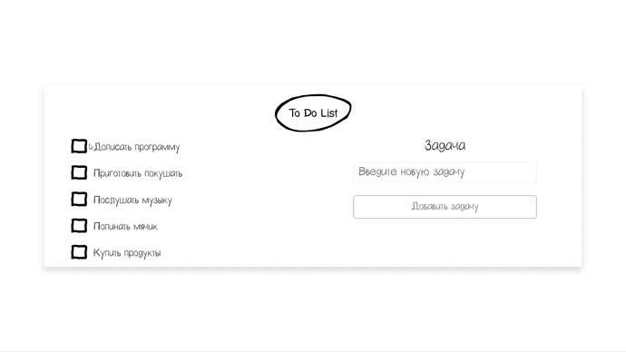

<h1 align="center">ToDoList</h1>

<h2 align="center">
    
    
    
    
</h2>

## Installation

1. Clone this repository: ```git clone https://github.com/gaziikk/ToDoList.git ```
2. Install ```virtualenv``` : ```python -m venv .venv```
3. Activate ```virtualenv``` : ```.venv/scripts/activate```
4. Change directory into ```to_do_list```: ```cd to_do_list```.
5. Install ```packages and modules```: ```pip install -r requirements.txt```
7. Run project: ```python manage.py runserver```
8. Run the migrations: ```python.exe manage.py migrate```

## Short description
A simple task management application. The interface resembles a regular list in notepad. There is a form where you can add new tasks. When you complete a task, just click on the box next to it to mark it as completed.

## Media materials
<p align="center">
    <br><br>
    
</p>
